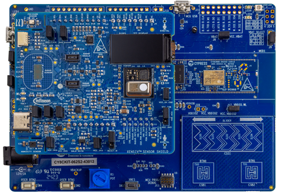
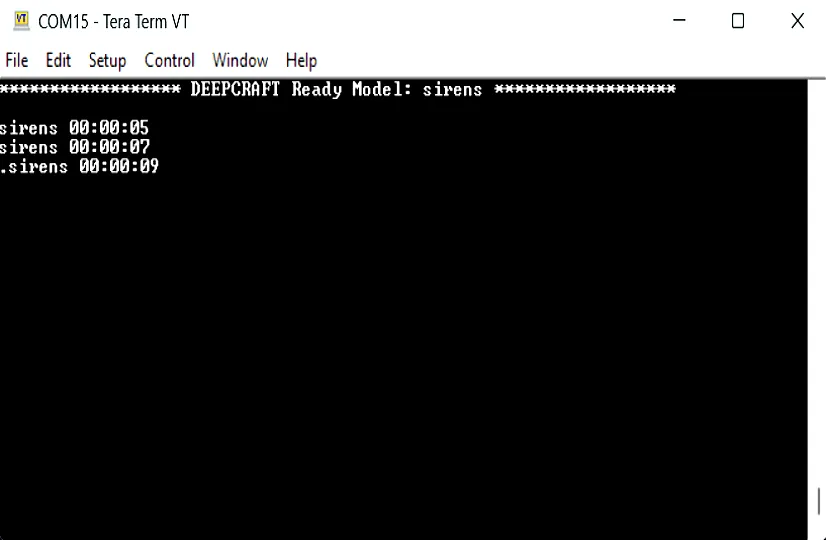

# DEEPCRAFT&trade; Ready Model deployment for PSOC&trade; 6 MCU

This code example demonstrates how to integrate a Ready Model library from the DEEPCRAFT&trade; Studio on ModusToolbox&trade;. The code example includes six different models, where five models detect different sounds:
- Baby cry detection
- Cough detection
- Alarm detection
- Siren detection
- Snoring detection

These models use data from pulse-density modulation (PDM) to pulse-code modulation (PCM), which is then sent to the model for detection.

The sixth model detects hand gestures uses data from the XENSIV&trade; radar sensor.


[View this README on GitHub.](https://github.com/Infineon/mtb-example-ml-deepcraft-deploy-ready-model)

[Provide feedback on this code example.](https://yourvoice.infineon.com/jfe/form/SV_1NTns53sK2yiljn?Q_EED=eyJVbmlxdWUgRG9jIElkIjoiQ0UyNDAzMDMiLCJTcGVjIE51bWJlciI6IjAwMi00MDMwMyIsIkRvYyBUaXRsZSI6IkRFRVBDUkFGVCZ0cmFkZTsgUmVhZHkgTW9kZWwgZGVwbG95bWVudCBmb3IgUFNPQyZ0cmFkZTsgNiBNQ1UiLCJyaWQiOiJoYXJzaGl0YW1hbm9qLmphaW5AaW5maW5lb24uY29tIiwiRG9jIHZlcnNpb24iOiIyLjIuMCIsIkRvYyBMYW5ndWFnZSI6IkVuZ2xpc2giLCJEb2MgRGl2aXNpb24iOiJNQ0QiLCJEb2MgQlUiOiJJQ1ciLCJEb2MgRmFtaWx5IjoiUFNPQyJ9)


## Requirements


- [ModusToolbox&trade;](https://www.infineon.com/modustoolbox) v3.1 or later (tested with v3.8)
- PSOC&trade; 6 board support package (BSP) minimum required version: 4.0.0
- Programming language: C
- Associated parts: All [PSOC&trade; 6 MCU](https://www.infineon.com/cms/en/product/microcontroller/32-bit-psoc-arm-cortex-microcontroller/psoc-6-32-bit-arm-cortex-m4-mcu) parts


## Supported toolchains (make variable 'TOOLCHAIN')

- GNU Arm&reg; Embedded Compiler v11.3.1 (`GCC_ARM`) – Default value of `TOOLCHAIN`


## Supported kits (make variable 'TARGET')


- [PSOC&trade; 6 AI Evaluation Kit](https://www.infineon.com/CY8CKIT-062S2-AI) (`CY8CKIT-062S2-AI`) – Default value of `TARGET`
- [PSOC&trade; 62S2 Wi-Fi Bluetooth&reg; Pioneer Kit](https://www.infineon.com/CY8CKIT-062S2-43012) (`CY8CKIT-062S2-43012`)


## Hardware setup

This example uses the board's default configuration for all supported kits except CY8CKIT-062S2-43012, which requires the XENSIV&trade; Sensor Shield SHIELD_XENSIV_A to be plugged in.

See the kit user guide to ensure that the board is configured correctly.

**Figure 1. SHIELD_XENSIV_A sensor shield connecting with CY8CKIT-062S2-43012 kit**



> **Note:** Ensure the J10 header is connected to a jumper between J10.2 and J10.3 pins on SHIELD_XENSIV_A shield to supply 3.3 V to the microphones.


## Software setup

See the [ModusToolbox&trade; tools package installation guide](https://www.infineon.com/ModusToolboxInstallguide) for information about installing and configuring the tools package.

- Install [DEEPCRAFT&trade; Studio](https://developer.imagimob.com/) if it is not already installed

- Install a terminal emulator if you do not have one. Instructions in this document use [Tera Term](https://teratermproject.github.io/index-en.html)

This example requires no additional software or tools.


## Using the code example


### Create the project

The ModusToolbox&trade; tools package provides the Project Creator as both a GUI tool and a command line tool.

<details><summary><b>Use Project Creator GUI</b></summary>

1. Open the Project Creator GUI tool

   There are several ways to do this, including launching it from the dashboard or from inside the Eclipse IDE. For more details, see the [Project Creator user guide](https://www.infineon.com/ModusToolboxProjectCreator) (locally available at *{ModusToolbox&trade; install directory}/tools_{version}/project-creator/docs/project-creator.pdf*)

2. On the **Choose Board Support Package (BSP)** page, select a kit supported by this code example. See [Supported kits](#supported-kits-make-variable-target)

   > **Note:** To use this code example for a kit not listed here, you may need to update the source files. If the kit does not have the required resources, the application may not work

3. On the **Select Application** page:

   a. Select the **Applications(s) Root Path** and the **Target IDE**

      > **Note:** Depending on how you open the Project Creator tool, these fields may be pre-selected for you

   b. Select this code example from the list by enabling its check box

      > **Note:** You can narrow the list of displayed examples by typing in the filter box

   c. (Optional) Change the suggested **New Application Name** and **New BSP Name**

   d. Click **Create** to complete the application creation process

</details>


<details><summary><b>Use Project Creator CLI</b></summary>

The 'project-creator-cli' tool can be used to create applications from a CLI terminal or from within batch files or shell scripts. This tool is available in the *{ModusToolbox&trade; install directory}/tools_{version}/project-creator/* directory.

Use a CLI terminal to invoke the 'project-creator-cli' tool. On Windows, use the command-line 'modus-shell' program provided in the ModusToolbox&trade; installation instead of a standard Windows command-line application. This shell provides access to all ModusToolbox&trade; tools. You can access it by typing "modus-shell" in the search box in the Windows menu. In Linux and macOS, you can use any terminal application.

The following example clones the "[mtb-example-ml-deepcraft-deploy-ready-model](https://github.com/Infineon/mtb-example-ml-deepcraft-deploy-ready-model)" application with the desired name "DeployReadyModel" configured for the *CY8CKIT-062S2-AI* BSP into the specified working directory, *C:/mtb_projects*:

   ```
   project-creator-cli --board-id CY8CKIT-062S2-AI --app-id mtb-example-ml-deepcraft-deploy-ready-model --user-app-name DeployReadyModel --target-dir "C:/mtb_projects"
   ```

The 'project-creator-cli' tool has the following arguments:

Argument | Description | Required/optional
---------|-------------|-----------
`--board-id` | Defined in the <id> field of the [BSP](https://github.com/Infineon?q=bsp-manifest&type=&language=&sort=) manifest | Required
`--app-id`   | Defined in the <id> field of the [CE](https://github.com/Infineon?q=ce-manifest&type=&language=&sort=) manifest | Required
`--target-dir`| Specify the directory in which the application is to be created if you prefer not to use the default current working directory | Optional
`--user-app-name`| Specify the name of the application if you prefer to have a name other than the example's default name | Optional
<br>


> **Note:** The project-creator-cli tool uses the `git clone` and `make getlibs` commands to fetch the repository and import the required libraries. For details, see the "Project creator tools" section of the [ModusToolbox&trade; tools package user guide](https://www.infineon.com/ModusToolboxUserGuide) (locally available at {ModusToolbox&trade; install directory}/docs_{version}/mtb_user_guide.pdf).

</details>


### Open the project

After the project has been created, you can open it in your preferred development environment.


<details><summary><b>Eclipse IDE</b></summary>

If you opened the Project Creator tool from the included Eclipse IDE, the project will open in Eclipse automatically.

For more details, see the [Eclipse IDE for ModusToolbox&trade; user guide](https://www.infineon.com/MTBEclipseIDEUserGuide) (locally available at *{ModusToolbox&trade; install directory}/docs_{version}/mt_ide_user_guide.pdf*).

</details>


<details><summary><b>Visual Studio (VS) Code</b></summary>

Launch VS Code manually, and then open the generated *{project-name}.code-workspace* file located in the project directory.

For more details, see the [Visual Studio Code for ModusToolbox&trade; user guide](https://www.infineon.com/MTBVSCodeUserGuide) (locally available at *{ModusToolbox&trade; install directory}/docs_{version}/mt_vscode_user_guide.pdf*).

</details>


<details><summary><b>Arm&reg; Keil&reg; µVision&reg;</b></summary>

Double-click the generated *{project-name}.cprj* file to launch the Keil&reg; µVision&reg; IDE.

For more details, see the [Arm&reg; Keil&reg; µVision&reg; for ModusToolbox&trade; user guide](https://www.infineon.com/MTBuVisionUserGuide) (locally available at *{ModusToolbox&trade; install directory}/docs_{version}/mt_uvision_user_guide.pdf*).

</details>


<details><summary><b>IAR Embedded Workbench</b></summary>

Open IAR Embedded Workbench manually, and create a new project. Then select the generated *{project-name}.ipcf* file located in the project directory.

For more details, see the [IAR Embedded Workbench for ModusToolbox&trade; user guide](https://www.infineon.com/MTBIARUserGuide) (locally available at *{ModusToolbox&trade; install directory}/docs_{version}/mt_iar_user_guide.pdf*).

</details>


<details><summary><b>Command line</b></summary>

If you prefer to use the CLI, open the appropriate terminal, and navigate to the project directory. On Windows, use the command-line 'modus-shell' program; on Linux and macOS, you can use any terminal application. From there, you can run various `make` commands.

For more details, see the [ModusToolbox&trade; tools package user guide](https://www.infineon.com/ModusToolboxUserGuide) (locally available at *{ModusToolbox&trade; install directory}/docs_{version}/mtb_user_guide.pdf*).

</details>


## Operation


1. Connect the board to your PC using the provided USB cable through the KitProg3 USB connector

   To select the model, update the `MODEL_SELECTION` variable in the *Makefile*

   **Table 1. Application resources**

   Model name           |  Macro
   :--------            | :-------------
   Cough detection      | `COUGH_MODEL`
   Alarm detection      | `ALARM_MODEL`
   Baby cry detection   | `BABYCRY_MODEL`
   Siren detection      | `SIREN_MODEL`
   Snore detection      | `SNORE_MODEL`
   Gesture detection    | `GESTURE_MODEL`


    >**Note:** Currently, gesture detection is only supported for the CY8CKIT-062S2-AI kit

2. Open a terminal program and select the KitProg3 COM port. Set the serial port parameters to 8N1 and 115200 baud

3. Program the board using one of the following:

   <details><summary><b>Using Eclipse IDE</b></summary>

      1. Select the application project in the Project Explorer

      2. In the **Quick Panel**, scroll down, and click **\<Application Name> Program (KitProg3_MiniProg4)**
   </details>


   <details><summary><b>In other IDEs</b></summary>

   Follow the instructions in your preferred IDE.

   </details>


   <details><summary><b>Using CLI</b></summary>

     From the terminal, execute the `make program` command to build and program the application using the default toolchain to the default target. The default toolchain is specified in the application's Makefile but you can override this value manually:
      ```
      make program TOOLCHAIN=<toolchain>
      ```

      Example:
      ```
      make program TOOLCHAIN=GCC_ARM
      ```
   </details>

4. After programming, the application starts automatically. Confirm that "DEEPCRAFT Ready Model: sirens" is displayed on the UART terminal

   **Figure 2. Terminal output on program startup for cough detection**

   

   <br>

   **Figure 3. Terminal output for recognized hand gestures**

   **Push gesture** | **Swipe left gesture** | **Swipe right gesture** | **Swipe up gesture** | **Swipe down gesture**
   ------------------------| ------------------------| ------------------------ | --------------------- | -----------------------
    |  |  |  | 


## Debugging

You can debug the example to step through the code.


<details><summary><b>In Eclipse IDE</b></summary>

Use the **\<Application Name> Debug (KitProg3_MiniProg4)** configuration in the **Quick Panel**. For details, see the "Program and debug" section in the [Eclipse IDE for ModusToolbox&trade; user guide](https://www.infineon.com/MTBEclipseIDEUserGuide).

> **Note:** **(Only while debugging)** On the CM4 CPU, some code in `main()` may execute before the debugger halts at the beginning of `main()`. This means that some code executes twice – once before the debugger stops execution, and again after the debugger resets the program counter to the beginning of `main()`. See [PSOC&trade; 6 MCU: Code in main() executes before the debugger halts at the first line of main()](https://community.infineon.com/docs/DOC-21143) to learn about this and for the workaround.

</details>


<details><summary><b>In other IDEs</b></summary>

Follow the instructions in your preferred IDE.

</details>


## Design and implementation


This code example provides the Ready Model library for the following use cases using microphone and XENSIV&trade; radar sensor.

> **Note:** The ready models included in this code example can run for a maximum of one hour. To extend the usage, purchase the license from [DEEPCRAFT&trade;](https://www.imagimob.com/ready-models).


### Audio detection

There are five models designed to detect different sounds, such as baby cry, cough, alarm, siren, and snoring. The models process audio data converted from pulse-density modulation (PDM) to pulse-code modulation (PCM), which is then sent to the model for detection.

The data consists of PDM/PCM audio samples. The PDM/PCM data is sampled at 16 kHz, and an interrupt is generated after 1024 samples are collected. Once 1024 samples are available, the data is fed to the DEEPCRAFT&trade; preprocessor through the `IMAI_AED_enqueue` function. After the preprocessor has enough data captured, `IMAI_AED_dequeue` returns a 60 by 20 buffer stored with the preprocessed data. This data is then passed to the model to detect and display the results on the UART terminal.

- **Cough detection:** This model gathers PDM/PCM audio data to detect cough audio

- **Factory alarm detection:** This model gathers PDM/PCM audio data to detect alarm (for example, fire alarm) audio

- **Baby cry detection:** This model gathers PDM/PCM audio data to detect baby crying audio

- **Siren detection:** This model gathers PDM/PCM audio data to detect siren audio

- **Snore detection:** This model gathers PDM/PCM audio data to detect snoring audio

The models are trained and designed to detect real instances of sounds. These sounds may differ from how they appear when played back through a speaker. For example, a real baby cry is around 100 dB to 120 dB, whereas playback from a speaker is usually around 50 dB. In such cases, the model may question the validity of the sound and may not trigger a detection. Therefore, whenever possible, testing should be performed in realistic scenarios.


#### Potential test setup

- **Cough detection:** Run the model on a wearable device, or place it on a desk nearby within 2 metres. Perform a forceful cough, as if you are sick, and observe the output

- **Factory alarm detection:** Run the model on a device in the factory, coordinate with the factory operation managers to schedule a time for testing when the alarms will be used. Observe the output of the model

- **Baby cry detection:** Run the model on a device and place it on a table about 2 metres away. Position a baby in a crib nearby and run the model continuously. Wait for a natural cry event and observe the model's detection output. Since this may take some time, a recording device can be used in parallel to correlate the detection time with the actual cry

- **Siren detection:** Contact your local ambulance, police, or firetruck facility for assistance. Run the model on the device and ask them to drive past with the siren activated. Observe the model output for detection

- **Snore detection:** Run the model on the device and place it on a bedside table. Allow the model to run overnight to detect real snores events. To validate the predictions, you can run a recording device in parallel and cross-validate the detected snore events. Alternatively, you can control the environment by ensuring one scenario where snoring is expected and another where it is not, and then verify the results using the terminal output


#### Audio signal properties diagnostic

This application includes an optional audio properties feature to monitor real-time audio signal characteristics, useful for microphone gain calibration and signal quality assessment. This feature exists to help you get a better understanding of the audio signal properties without listening to it. You can use it for example to evaluate if the audio is too loud or too quiet or if you are getting too much signal saturation in the system which can cause a distorted sound.

##### Enabling audio properties

To enable the audio properties feature, edit the *Makefile* in the project directory and set the `AUDIO_PROPERTIES` variable to `ENABLE`:

```
AUDIO_PROPERTIES=ENABLE
```

By default, `AUDIO_PROPERTIES` is set to `DISABLE`. After changing this setting, rebuild the application:

```
make clean
make build
```

##### Audio properties output

When the audio properties feature is enabled, signal metrics are calculated and printed for each audio frame processed. The feature analyzes the audio buffer to extract signal quality information.

- **Measurement unit:** Normalized float values (0.0 to 1.0)
- **Output format:** Each line shows the signal analysis for one audio frame

Example UART output when audio properties is enabled alone:
```
RMS: 0.004321, Clip Count: 0, Max: 0.008923 Buff: 73
RMS: 0.003456, Clip Count: 1, Max: 0.009234 Buff: 64
RMS: 0.005123, Clip Count: 0, Max: 0.010567 Buff: 82
```

Where:
- `RMS: <value>` – Root mean square (RMS) audio level, normalized to [0, 1]
- `Clip Count: <count>` – Number of samples in the frame that exceeded the clipping threshold (|sample| > 0.95)
- `Max: <value>` – Peak sample magnitude (maximum absolute value) in the frame
- `Buff: <value>` – Sample value at buffer position 200 (for diagnostic reference)

#### Microphone gain settings

For effective microphone utilization, it is important to ensure that the gain of the microphone is configured correctly so that incoming sounds are captured at the appropriate amplitude. This helps the model to perform detection more reliably, as the input audio is closer to what the model expects. For example, a snore arrives at a lower amplitude and is relatively quiet, whereas a siren is received at a much higher amplitude and is significantly louder. Below are two examples of microphone calibration. In practice, you can use a standard smart phone as a baseline reference and adjust the MCU microphone output to match it.

Bear in mind when performing the tuning/calibration the steps are first done for the positive data in order to get it into the right ballpark then it was validated by testing on the negative data to ensure we don't overtune the sensitivity. In the end the goal is to tune the microphone so that the sound levels come out balanced and as if recorded with a standard off the shelf recording device. We're not trying to finetune the microphone for a specific sound.

##### Calibrating the microphone for snore detection
1. Record a reference snore sample using the target device
   * Record audio from a real snoring event (do not use loudspeaker playback)
   * Maintain a distance of at least 0.5 m and no more than 1.0 m from the sound source
   * Perform the recording under normal operating conditions
2. Measure RMS
   * Calculate RMS value for the snore event only
3. Compare the measured RMS value against the training data range
   * Target snore RMS range: [-51 dB, -21 dB] as determined from a data-distribution study
4. Adjust microphone gain
   * If RMS is below the target range, gradually increase the gain
   * If RMS is above the target range, gradually decrease the gain
5. Verify using non-snore RMS
   * Record typical “home” sounds such as speech, movement, and ambient noises
   * Training non‑snore RMS target range: [-30 dB, -16 dB]
   * If the measured non‑snore RMS target range falls within this range, the calibration is confirmed
   * If not: fine‑tune the gain, prioritizing alignment with the snore RMS target, and then re‑check


##### Calibrating the microphone for baby cry detection
1. Record a reference baby cry sample using the target device
   * Record audio from a real baby cry event (do not use loudspeaker playback)
   * Maintain a distance of at least 0.2 m and no more than 1.0 m from the sound source
   * Perform the recording under normal operating conditions
2. Measure RMS
   * Calculate RMS value for the baby cry event only
3. Compare the measured RMS value against the training data range
   * Target baby cry RMS range: [-50 dB, -15 dB]
4. Adjust microphone gain
   * If the RMS value is below the target range, gradually increase the gain
   * If the RMS value is above the target range, gradually decrease the gain
5. Verify using non-baby cry RMS
   * Record typical baby sounds such as talking, laughing, and cooing
   * Training non-baby-cry RMS target range: [-50 dB, -10 dB]
   * If the measured non-baby-cry RMS falls within this range, the calibration is confirmed
   * If not, fine-tune the gain, prioritizing alignment with the baby-cry RMS target, and then re-check


##### Utilizing the gain cycling feature
This example includes a runtime software-gain control mechanism that is mapped to the user button (`CYBSP_USER_BTN`). This button then controls the following variable in the code `scaling_factor` through an ISR.

Each button press cycles the scaling factor through six levels in a loop:
- 2
- 4
- 6
- 8
- 10
- 1

After each button press, the current scaling factor is printed on the UART terminal, allowing users to immediately confirm the active gain level. This feature can be used during testing to adjust the input signal amplitude to a realistic range for the environment and model which helps when doing general testing. This feature allows you to increase the microphone gain during runtime.

To utilise this correctly you can check the incoming sound level and increase or decrease the software gain multiplier to adjust level so that it balances out the sound to a realistic level so that you can maximise the prediction accuracy.

#### Performance profiling for audio detection

This application includes an optional profiling feature to measure and monitor inference latency of the audio detection models running on the FreeRTOS-based system. This lets you understand better how the model is running and evaluate if it's running quick enough to avoid bottlenecks.

##### Enabling profiling

To enable the profiling feature, edit the *Makefile* in the project directory and set the `PROFILING` variable to `ENABLE`:

```
PROFILING=ENABLE
```

By default, `PROFILING` is set to `DISABLE`. After changing this setting, rebuild the application:

```
make clean
make build
```

##### Profiling output

When profiling is enabled, the inference time for each audio frame is printed to the UART terminal. The profiling feature measures the time elapsed between audio frame queueing and model inference result, providing real-time insights into detection latency on the target hardware.

- **Measurement unit:** Milliseconds (ms)
- **Time resolution:** 1 ms (based on SysTick counter)
- **Output format:** Each line shows the inference time for one input data window

Example UART output when profiling is enabled alone:
```
infer_time: 27
infer_time: 28
infer_time: 27
```

This example tells us that in the 3 times the model was run, the time it took to perform a forward pass through the pre-processor and the network was 27, 28 and 27 milliseconds.

### Gesture detection

The gesture detection model gathers preprocessed radar data to detect different gestures, such as left, right, up, down, and push using the Ready Model library.

The data consist of raw radar sensor data. After data collection, preprocessing is done on the raw data. It is then fed to the DEEPCRAFT&trade; preprocessor through the `IMAI_AED_enqueue` function. After the preprocessor has sufficient data captured, `IMAI_AED_dequeue` returns a buffer stored with the preprocessed data. The data is then passed to the gesture detection model. The detected results are then displayed on the UART terminal.


### Resources and settings

**Table 2. Application resources**

 Resource      |  Alias/object           |    Purpose
 :--------     | :--------------------   | :------------
 GPIO (HAL)    | CYBSP_USER_LED          | User LED
 UART (HAL)    | cy_retarget_io_uart_obj | UART HAL object used by Retarget-IO for the Debug UART port
 SPI (HAL)     | spi_obj                 | SPI HAL object used to communicate with the radar sensor
 PDM_PCM       | pdm_pcm                 | PDM HAL object used to interact with the kit PDM sensors
<br>


## Related resources

Resources  | Links
-----------|----------------------------------
Application notes  | [AN228571](https://www.infineon.com/AN228571) – Getting started with PSOC&trade; 6 MCU on ModusToolbox&trade; <br>  [AN215656](https://www.infineon.com/AN215656) – PSOC&trade; 6 MCU: Dual-CPU system design
Code examples  | [Using ModusToolbox&trade;](https://github.com/Infineon/Code-Examples-for-ModusToolbox-Software) on GitHub
Device documentation | [PSOC&trade; 6 MCU datasheets](https://documentation.infineon.com/html/psoc6/bnm1651211483724.html) <br> [PSOC&trade; 6 technical reference manuals](https://documentation.infineon.com/html/psoc6/zrs1651212645947.html)
Development kits | Select your kits from the [Evaluation board finder](https://www.infineon.com/cms/en/design-support/finder-selection-tools/product-finder/evaluation-board)
Libraries on GitHub  | [mtb-pdl-cat1](https://github.com/Infineon/mtb-pdl-cat1) – PSOC&trade; 6 Peripheral Driver Library (PDL)  <br> [mtb-hal-cat1](https://github.com/Infineon/mtb-hal-cat1) – Hardware Abstraction Layer (HAL) library <br> [retarget-io](https://github.com/Infineon/retarget-io) – Utility library to retarget STDIO messages to a UART port
Middleware on GitHub  | [psoc6-middleware](https://github.com/Infineon/modustoolbox-software#psoc-6-middleware-libraries) – Links to all PSOC&trade; 6 MCU middleware
Tools  | [ModusToolbox&trade;](https://www.infineon.com/modustoolbox) – ModusToolbox&trade; software is a collection of easy-to-use libraries and tools enabling rapid development with Infineon MCUs for applications ranging from wireless and cloud-connected systems, edge AI/ML, embedded sense and control, to wired USB connectivity using PSOC&trade; Industrial/IoT MCUs, AIROC&trade; Wi-Fi and Bluetooth&reg; connectivity devices, XMC&trade; Industrial MCUs, and EZ-USB&trade;/EZ-PD&trade; wired connectivity controllers. ModusToolbox&trade; incorporates a comprehensive set of BSPs, HAL, libraries, configuration tools, and provides support for industry-standard IDEs to fast-track your embedded application development

<br>


## Other resources

Infineon provides a wealth of data at [www.infineon.com](https://www.infineon.com) to help you select the right device, and quickly and effectively integrate it into your design.


## Document history

Document title: *CE240303* – *DEEPCRAFT&trade; Ready Model deployment for PSOC&trade; 6 MCU*

 Version | Description of change
 ------- | ---------------------
 1.0.0   | New code example
 2.0.0   | Updated to support ml-tflite-micro v3.X
 2.1.0   | Added switch cases for handling different states of the ready model
 2.2.0   | Implemented DMA-based PDM microphone capture for improved performance <br> Added profiling feature <br> Added feature to calculate different properties of the audio signal <br> Added button press functionality to cycle through different scaling factors for the audio signal
<br>


All referenced product or service names and trademarks are the property of their respective owners.

The Bluetooth&reg; word mark and logos are registered trademarks owned by Bluetooth SIG, Inc., and any use of such marks by Infineon is under license.

PSOC&trade;, formerly known as PSoC&trade;, is a trademark of Infineon Technologies. Any references to PSoC&trade; in this document or others shall be deemed to refer to PSOC&trade;.


---------------------------------------------------------

(c) 2026, Infineon Technologies AG, or an affiliate of Infineon Technologies AG. All rights reserved.
This software, associated documentation and materials ("Software") is owned by Infineon Technologies AG or one of its affiliates ("Infineon") and is protected by and subject to worldwide patent protection, worldwide copyright laws, and international treaty provisions. Therefore, you may use this Software only as provided in the license agreement accompanying the software package from which you obtained this Software. If no license agreement applies, then any use, reproduction, modification, translation, or compilation of this Software is prohibited without the express written permission of Infineon.
<br>
Disclaimer: UNLESS OTHERWISE EXPRESSLY AGREED WITH INFINEON, THIS SOFTWARE IS PROVIDED AS-IS, WITH NO WARRANTY OF ANY KIND, EXPRESS OR IMPLIED, INCLUDING, BUT NOT LIMITED TO, ALL WARRANTIES OF NON-INFRINGEMENT OF THIRD-PARTY RIGHTS AND IMPLIED WARRANTIES SUCH AS WARRANTIES OF FITNESS FOR A SPECIFIC USE/PURPOSE OR MERCHANTABILITY. Infineon reserves the right to make changes to the Software without notice. You are responsible for properly designing, programming, and testing the functionality and safety of your intended application of the Software, as well as complying with any legal requirements related to its use. Infineon does not guarantee that the Software will be free from intrusion, data theft or loss, or other breaches (“Security Breaches”), and Infineon shall have no liability arising out of any Security Breaches. Unless otherwise explicitly approved by Infineon, the Software may not be used in any application where a failure of the Product or any consequences of the use thereof can reasonably be expected to result in personal injury.
